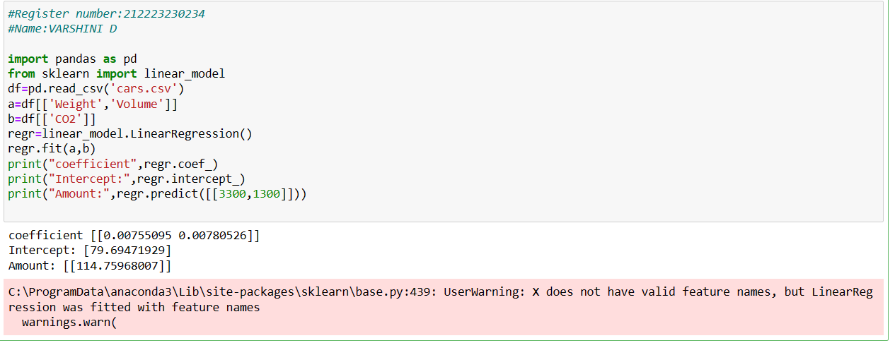

# Implementation of Multivariate Linear Regression
## Aim
To write a python program to implement multivariate linear regression and predict the output.
## Equipment’s required:
1.	Hardware – PCs
2.	Anaconda – Python 3.7 Installation / Moodle-Code Runner
## Algorithm:
### Step1:
Import pandas as pd.
### Step2:
Read the csv file.
### Step3:
Get the value of X and Y variables.
### Step4:
Create the linear regression model and fit.
### Step5:
Predict the CO2 emission of a car.
### Step6:
Predict the output.

## Program:
```
 #Developed by : VARSHINI D
 #REGISTER NUMBER : 212223230234
 '''
 import pandas as pd
 from sklearn import linear_model
 df=pd.read_csv('cars.csv')
 a=df[['Weight','Volume']]
 b=df[['CO2']]
 regr=linear_model.LinearRegression()
 regr.fit(a,b)
 print("coefficient",regr.coef_)
 print("Intercept:",regr.intercept_)
 print("Amount:",regr.predict([[3300,1300]]))

```
## Output:


## Result
Thus the multivariate linear regression is implemented and predicted the output using python program.